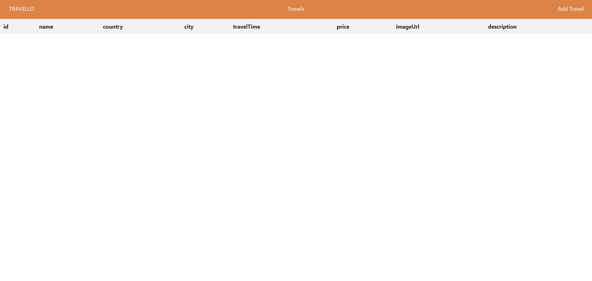
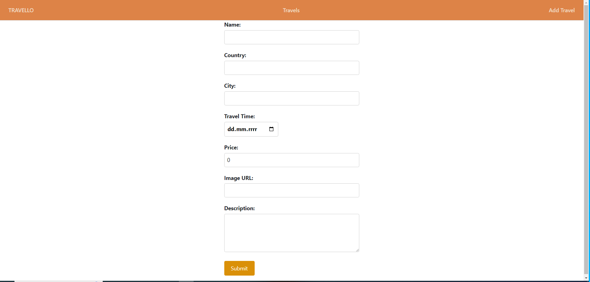
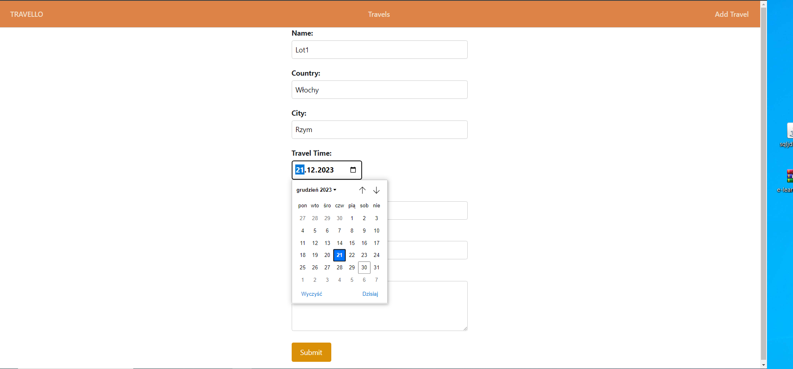

# Zarządzanie Lotami

> Aplikacja do zarządzania lotami stworzona w Angularze. Jest to narzędzie umożliwiające dodawanie i wyświetlanie lotów, przeznaczone dla firm lotniczych i biur podróży.

## Spis Treści
* [Informacje Ogólne](#informacje-ogólne)
* [Technologie Użyte](#technologie-użyte)
* [Funkcjonalności](#funkcjonalności)
* [Zrzuty Ekranu](#zrzuty-ekranu)
* [Instalacja](#instalacja)
* [Jak Korzystać](#jak-korzystać)
* [Status Projektu](#status-projektu)
* [Obszary do Rozwoju](#obszary-do-rozwoju)
* [Podziękowania](#podziękowania)
* [Kontakt](#kontakt)

## Informacje Ogólne
- Celem projektu jest zapewnienie łatwego w obsłudze narzędzia do zarządzania lotami.
- Aplikacja oferuje intuicyjny interfejs do dodawania i przeglądania lotów.

## Technologie Użyte
- Angular
- TypeScript
- HTML
- CSS
- Visual Studio Code

## Funkcjonalności
- Dodawanie lotów do systemu.
- Wyświetlanie listy dostępnych lotów.
- Interfejs użytkownika do zarządzania informacjami o lotach.

## Zrzuty Ekranu

**Strona główna**

**Dodawanie lotu**

**Wpisywanie danych**

## Instalacja
Aby uruchomić projekt lokalnie, wykonaj następujące kroki:
1. Sklonuj repozytorium projektu na swój lokalny dysk.
2. Otwórz folder projektu w Visual Studio Code.
3. W terminalu VSCode wpisz `npm install`, aby zainstalować wszystkie zależności.
4. Po zakończeniu instalacji wpisz `ng serve`, aby uruchomić serwer deweloperski.
5. Otwórz przeglądarkę i przejdź pod adres `http://localhost:4200`.
6. Podłącz własną bazę danych do aplikacji.

## Jak Korzystać
- Użyj interfejsu aplikacji do dodawania nowych lotów.
- Przeglądaj i zarządzaj listą dostępnych lotów.
- Wykorzystaj funkcje aplikacji do planowania i organizacji lotów.

## Status Projektu
Projekt jest w trakcie rozwoju.

## Obszary do Rozwoju
- Dodanie innych zakładek związanych z zarządzaniem lotami.
- Integracja z kalendarzem wylotów.
- Rozszerzenie funkcjonalności zarządzania lotami.

Do zrobienia:
- Rozbudowa interfejsu użytkownika.
- Integracja z zaawansowanymi systemami baz danych.

## Podziękowania
- Projekt został wykonany samodzielnie.

## Kontakt
Stworzone przez [@Pawni](https://github.com/Pawgni)

